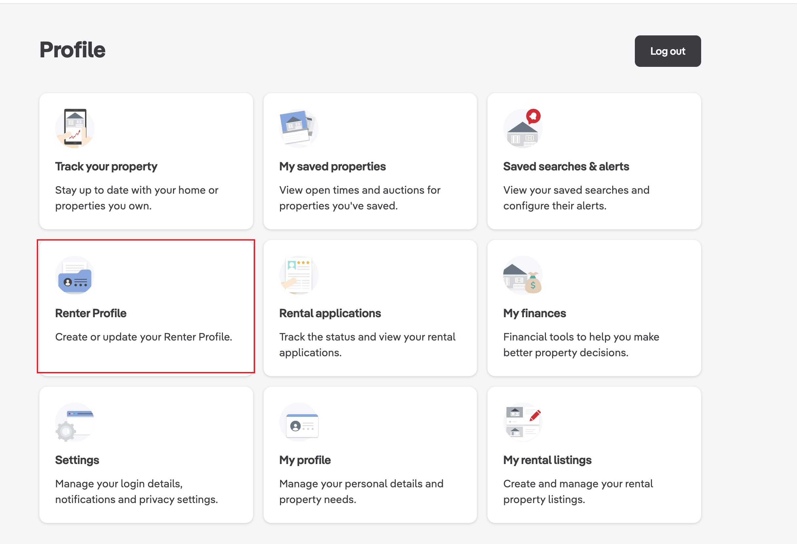

# 记录2024年中在澳洲的租房经历

## 前言
从2022年来澳洲读研, 直到2024年5月13日一直是住在UNSW学校宿舍, 起初是在Barker Apartment住了一个学期, 5人的公寓, 条件相对简陋, 之后由于作为Returning Resident, 有机会住到了较新的University Terraces, 还是一个单人Studio, 各方面都比Barker好很多, 价格也只贵了30pw. 但是由于毕业, 不得不搬出学校公寓, 于是开始了在悉尼租房的经历.

## 寻找房源

### 租房平台
在澳洲找房的主要方式有以下几种:
1. [RealEstate](https://www.realestate.com.au/)
2. [今日悉尼](https://www.sydneytoday.com/)
3. [小红书](https://www.xiaohongshu.com/)

今日悉尼和小红书比较类似  
优点: 中文沟通便利, 很多房子是包bill(水, 电, 气和网络)和家具的, 比较省心  
缺点: 房源少, 信息更新不及时, 由于没有大多没有签订正规合同, 如果遇上没什么素质的房东, 会出现很多扯皮的情况

RealEstate  
优点: 房源多, 信息更新及时, 基本都由正规中介代理, 会签订租房合同, 价格相对公道  
缺点: 基本都是整租房屋, 所以需要自己找室友, 不包bill, 绝大多数也不包家具, 需要用英文和中介沟通(包括看房, 签合同等)

因为我刚刚毕业正在找工作, 然后有一个进度差不多的同学, 大家时间充足, 就一起琢磨着用尽量少的资金整租一个条件不错的2b2b/2b1b的房子, 同时体验一下澳洲本地租房的流程. 鉴于今日悉尼和小红书上的房源太少, 不符合我对价格, 位置, 环境的要求, 于是我们选择了RealEstate.

### RealEstate使用

注册账号后需要填写Renter Profile(虽然从后来的经验来看填这些有点多余, 不过这些准备工作也可以用在向中介提交租房申请的步骤中), 其中包含以下几个部分:
1. **Personal Details**  
    基本信息, 如实填写即可

2. 1. **About me**  
    有点像找工作时需要的cover letter, 简单介绍一下自己来澳洲的居住经历, 为什么要换房, 保证自己按时交房租, 有良好的生活习惯等等

    2. **Optional supporting documents**  
    可以上传一些材料, 比如学生证,银行流水(bank statement), 前房东提供的居住证明, 无犯罪证明等等, 如果之前自己准备过申请485工签的材料, 这一步会非常容易

3. **Address History**
    添加最近至少两年的居住地址, 以及居住时间

4. **Employment**
    工作信息, 如果没有工作就勾选`I am currently not employed`

5. **Income**
    收入信息, 通过上传银行流水, 房租账单等等来证明

6. **Identity documents**
    护照, 驾照, 学生证等等

7. **Emergency contact**
    填写父母或者朋友的联系方式

8. **Tenant Check**
    付费的服务, 检查自己的信用记录, 感觉没有必要

9. **People**
    添加室友信息
10. **Pets**
    添加宠物信息
11. **Utility connection service**
    帮助联系水电气网络等服务, 不太有必要, 不如自己联系, 因为有可能会被收取额外费用或者选择较贵的供应商或者套餐

### 筛选房源
按照自己的需求筛选房源, 包括房型, 位置, 价格, 是否有家具, 卧室数量, 浴室数量, 可用时间(available date).
中介一般会把avaible date在网站上写的早一些, 所以实际的可入住时间通常会晚几天. 而且很多不太抢手的房子中介也能接受免费保留一段时间(比如我这次这个), 因此对于网站上显示avaiable now的房子, 也可以放心申请.

### 看房(Inspection)
分为public和private两种, public就是中介在某个时间段内开放给所有人看房, private就是预约时间单独看房. 我理解就是中介在realestate上发布的inspection time就是public.  
如果你看上的房子没有inspection time, 可以联系页面上负责的中介进行预约, 一般电话沟通会比较快, 下班时间很多中介也会接电话的, 尤其是华人中介, 比较拼.  
另外就是尽量按规定时间去看房, 因为中介一般会有多个房子要看, 约定的时间结束没人来看房, 中介一般就直接走了.  
Inspection的过程中可以拍照或者录视频, 方便之后做对比.

## 提交申请
看完房比较满意就可以开始申请了, 申请所需要的文件和之前RealEstate账号中填写的Renter Profile基本一致. 如果是多个人住, 每个人都需要提交申请.  
申请过程中也有一个付费的tenant check, 没必要选. 包括有一个免费的connect utility service, 是用来帮助联系水电气网络等服务, 不太有必要, 不如自己联系, 因为有可能会给你选较贵的供应商或者套餐.  
其他的就是按照提示填写, 上传文件.

## 申请成功
如果中介和房东接受了你的申请, 会发邮件通知你, 然后打电话来让你交定金(deposit), 一般是一周的房租. 交完定金之后两个工作日他们会把这个房子从网站上下架. 再过几天之后会发租房合同, 并且让你交押金(bond), 这个是交给新州政府, 一般是四周的房租.

### 能源(Utilities)和网络
- 水: 因为我租的是公寓, 水费是由房东统一支付的, 所以不用自己联系
- 电和天然气: 在和中介确认可以自己选择供应商之后, 可以去[Energy Made Easy](https://www.energymadeeasy.gov.au/)比较不同供应商的价格, 选择合适的套餐, 电和天然气选择同一个供应商会方便管理而且可能会有优惠. 
- 网络: 参考了下小红书上的评价, 如果是NBN, 首选Aussie Broadband, 因为服务好, 网络稳定, 价格稍微贵点儿. 但是modem最好还是自己买, 供应商那儿直接买会很贵, 只要买满足要求的modem就行. 不同的小区会有不同的网络接入类型, FTTN/FTTB, FTTP, 所以对modem的配置要求也不太一样, 具体的要求会在订购的时候显示, 比如我这个就是要求必须支持VDSL2.

## 搬家